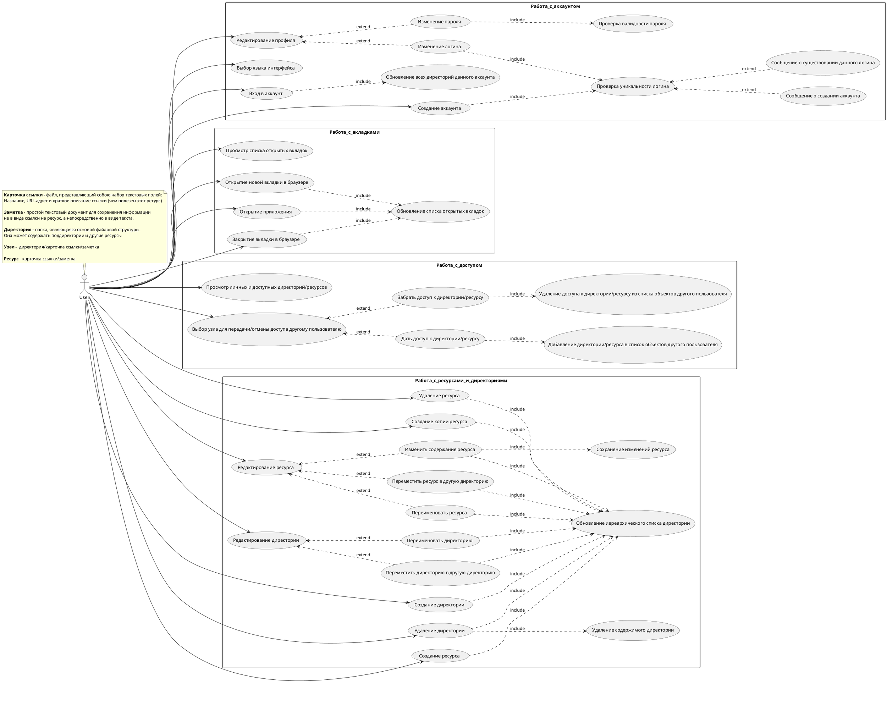

```plantuml
@startuml

:User: as User

	note left of User
		**Карточка ссылки** - файл, представляющий собою набор текстовых полей:
		Название, URL-адрес и краткое описание ссылки (чем полезен этот ресурс)
		
		**Заметка** - простой текстовый документ для сохранения информации
		не в виде ссылки на ресурс, а непосредственно в виде текста.
		
		**Директория** - папка, являющаяся основой файловой структуры. 
		Она может содержать поддиректории и другие ресурсы
		
		**Узел** -  директория/карточка ссылки/заметка
		
		**Ресурс** - карточка ссылки/заметка
	end note	

	rectangle Работа_с_аккаунтом{
		(Создание аккаунта) as Registr_acc
		(Вход в аккаунт) as Enter_in_app 
		(Проверка уникальности логина) as Login_done
		(Сообщение о создании аккаунта) as Login_massage
		(Сообщение о существовании данного логина) as Login_error_massage
		(Обновление всех директорий данного аккаунта) as Reload_data

		(Редактирование профиля) as Edit_profil 
		(Изменение пароля) as Edit_password 
		(Изменение логина) as Edit_login
		(Проверка валидности пароля) as Check_password

		 (Выбор языка интерфейса) as Language

	}

	rectangle Работа_с_ресурсами_и_директориями{
		(Создание ресурса) as Create_resurs 
		(Удаление ресурса) as Delete_resurs
		(Редактирование ресурса) as Redact_resurs
		(Переименовать ресурса) as Rename_resurs
		(Изменить содержание ресурса) as Refile_resurs
		(Переместить ресурс в другую директорию) as Relocate_resurs
		(Обновление иереархического списка директории) as Reload_ier
		(Сохранение изменений ресурса) as Save_resurs
		(Создание копии ресурса) as Copy_resurs
		
		(Создание директории) as Create 
		(Удаление директории) as Delete
		(Редактирование директории) as Redact_dir
		(Переименовать директорию) as Rename_dir
		(Переместить директорию в другую директорию) as Relocate_dir
		(Удаление содержимого директории) as Delete_include
	}


	rectangle Работа_с_вкладками{
		(Открытие новой вкладки в браузере) as Open_link 
		(Открытие приложения) as Open_app
		(Закрытие вкладки в браузере) as Close_link
		(Просмотр списка открытых вкладок) as Show_link
		(Обновление списка открытых вкладок) as Refresh_link
	}

	rectangle Работа_с_доступом{
		(Дать доступ к директории/ресурсу) as Give_dostup 
		(Выбор узла для передачи/отмены доступа другому пользователю) as Choice_dostup
		(Забрать доступ к директории/ресурсу) as Take_dostup
		(Просмотр личных и доступных директорий/ресурсов) as Show_dostup
		(Удаление доступа к директории/ресурсу из списка объектов другого пользователя) as Delete_dostup
		(Добавление директории/ресурса в список объектов другого пользователя) as Add_file
	}

	 Choice_dostup <.. Give_dostup : extend
	 Choice_dostup <.. Take_dostup : extend
	 Give_dostup ..> Add_file : include
	 Take_dostup ..> Delete_dostup : include

	 Open_link ..> Refresh_link : include
	 Open_app ..> Refresh_link : include
	 Close_link ..> Refresh_link : include

	 Enter_in_app ..> Reload_data : include
	 Registr_acc ..> Login_done : include
	 Login_done <.. Login_massage : extend
	 Login_done <.. Login_error_massage : extend

	 Edit_profil <.. Edit_password : extend
	 Edit_profil <.. Edit_login : extend
	 Edit_password ..> Check_password : include
	 Edit_login ..> Login_done : include

	 Delete ..> Delete_include : include
	 Redact_dir <.. Rename_dir : extend
	 Redact_dir <.. Relocate_dir : extend
	 Delete ..> Reload_ier : include
	 Relocate_dir ..> Reload_ier : include
	 Create ..> Reload_ier : include
	 Rename_dir ..> Reload_ier : include

	 Redact_resurs <.. Rename_resurs : extend
	 Redact_resurs <.. Refile_resurs : extend
	 Redact_resurs <.. Relocate_resurs : extend
	 
	 Rename_resurs ..> Reload_ier : include
	 Refile_resurs ..> Reload_ier : include
	 Relocate_resurs ..> Reload_ier : include
	 Create_resurs ..> Reload_ier : include
	 Delete_resurs ..> Reload_ier : include
	 Copy_resurs ..> Reload_ier : include
	 Refile_resurs ..> Save_resurs : include

left to right direction

User -d-> Create
User -d-> Delete
User -d-> Redact_dir
User -d-> Language

User -d-> Enter_in_app
User -d-> Registr_acc
User -d-> Edit_profil

User -d-> Create_resurs
User -d-> Delete_resurs
User -d-> Redact_resurs

User -d-> Copy_resurs

User -d-> Open_link
User -d-> Open_app
User -d-> Close_link
User -d-> Show_link

User -d-> Choice_dostup
User -d-> Show_dostup

@enduml
```

